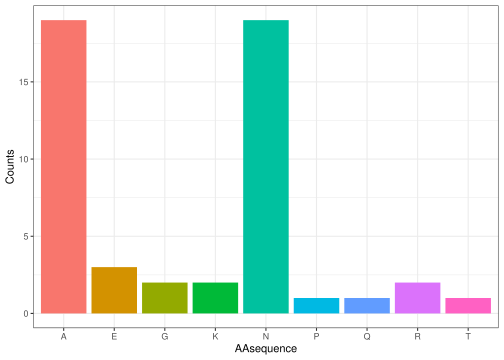

<!-- README.md is generated from README.Rmd. Please edit that file -->

``` r
library("dogma7")
```

# Vignette for package dogma7

**Package Dogma7 is an R package designed for DNA and RNA sequence
manipulation. It includes a set of functions to generate, convert,
splice, and analyze genetic sequences.**

## **Function 1:** **`sample_nucleotides(sample_size = 100)`**

Takes as argument an integer “sample_size”. Generates a DNA sequence
(string) of random nucleotides (“ATCG”) of size “sample_size”.

If no value is specified, sample_size = 100 by default.

**Example:** 

``` r
DNA_seq <- sample_nucleotides(100)
print(DNA_seq)
#> [1] "CCGATATTACTCCAATTGTTGCGGTACTCGTCTAGTTACGTAAGTATTTGGCTCATACGCCCTCCTCTAAGATAGCCGACTTGCGCCTGTTTCATCACTA"
```

## **Function 2: `thymine_to_uracil(DNA_seq)`**

The thymine_to_uracil function converts a DNA sequence to an RNA
sequence by replacing “T” with “U.”

**Example:**

``` r
RNA_seq <- thymine_to_uracil(DNA_seq)

print(RNA_seq)
#> [1] "CCGAUAUUACUCCAAUUGUUGCGGUACUCGUCUAGUUACGUAAGUAUUUGGCUCAUACGCCCUCCUCUAAGAUAGCCGACUUGCGCCUGUUUCAUCACUA"
```

## **F**unction 3: **`seq_to_codons(nucleotide_seq, start = 1)`**

This function takes a DNA sequence (char) and a start number (int) for
the position in which you start the splicing. The function will then cut
the sequence into codons and store them (char) in a list to be returned.
If no start value is defined, it will be 1 as default.

**Example:** 

``` r
codons_list <- seq_to_codons(DNA_seq)

print(codons_list)
#>  [1] "CCG" "ATA" "TTA" "CTC" "CAA" "TTG" "TTG" "CGG" "TAC" "TCG" "TCT" "AGT"
#> [13] "TAC" "GTA" "AGT" "ATT" "TGG" "CTC" "ATA" "CGC" "CCT" "CCT" "CTA" "AGA"
#> [25] "TAG" "CCG" "ACT" "TGC" "GCC" "TGT" "TTC" "ATC" "ACT"
```

## **Function 4: `amino_acid(codons)`**

The function performs codon to amino acid translation, thus the name
“translate”. The function takes a sequence of codons as input and
returns the corresponding amino acid sequence.

Function parameters:

- Input - ’**codons’**: string containing a sequence of codons that must
  be translated into amino acids.

- Return value - **‘amino acid’:** corresponding amino acid is provided.

- @export - can be pull out from the package and be used by others

**Example:** 

``` r
amino_acid = translate(codons_list)

print(amino_acid)
#> [1] "PNANANAQNANARNANANANANANANANANANANARNANANARNAPNANAANANANANA"
```

## **Function 5:** `barplot_unique_chars(aa_sequence)`

This function takes a sequence of amino acids, or just a string of
characters, and first makes a list of unique amino acids. Then it counts
the number of occurrences for each amino acid, and plots this as a
barplot.

**Example:**

``` r
barplot_unique_chars(amino_acid)
```

<!-- -->

## **Discussion Task 3**

We added package dependencies in function5 using the command @importFrom
in the Roxygen skeleton. It is always better to limit the number of
dependencies because the packages can be constantly updated and we would
have compatibility issues. Moreover, if there is a loading error in a
dependency, then the package would not run properly. @importFrom imports
the function as a default usage. Whenever the function is called, it is
always referring to the one from the package we imported; whereas the
package::function() notation specifies directly which package the
function is from every time it is called, therefore ensuring better
understanding of the code. This allows versatility in our coding style
and efficient package managing.

### Potential additional functions

Reverse transcription: Going from protein sequence to DNA sequence.

Motive search: A function searching specific sequence motifs within DNA
or RNA sequences.

### Use cases

This package is useful in genomic analysis and protein discovery.
